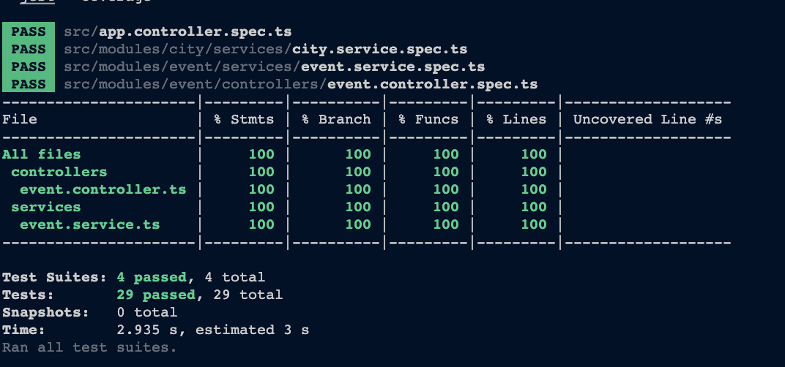

## Links
- Postman: https://documenter.getpostman.com/view/4219273/2sA2xnxVfW
- Swagger Link: `localhost:3000/api/docs`

## How to Run

1. make sure you have nodejs version with minimal `v20.8.1`
2. install all dependencies.
```shell
  npm install
```
3. run this command to run the project.
```shell
  npm run start:dev
```

## Modules
- `City` has unique `name` constraint for combination of `countryName` and `name`
- `Event` has unique `name` constraint for combination of `cityId` and `name`

## Test Coverage
- Automation Testing (Unit Test & Integration Test)
```shell
  npm run test
```

- Test Coverage
```
  npm run test:cov
```

### Test Coverage Result
this is test coverage for `unit test` and `integration test` for `Event Module`
